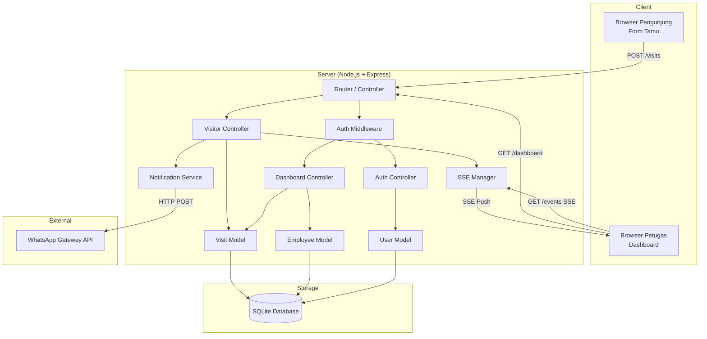
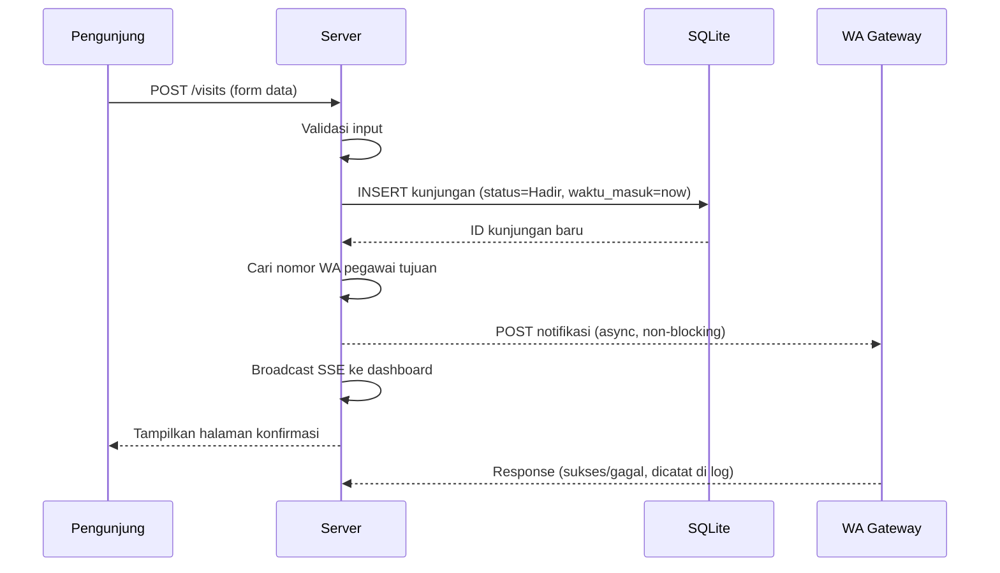
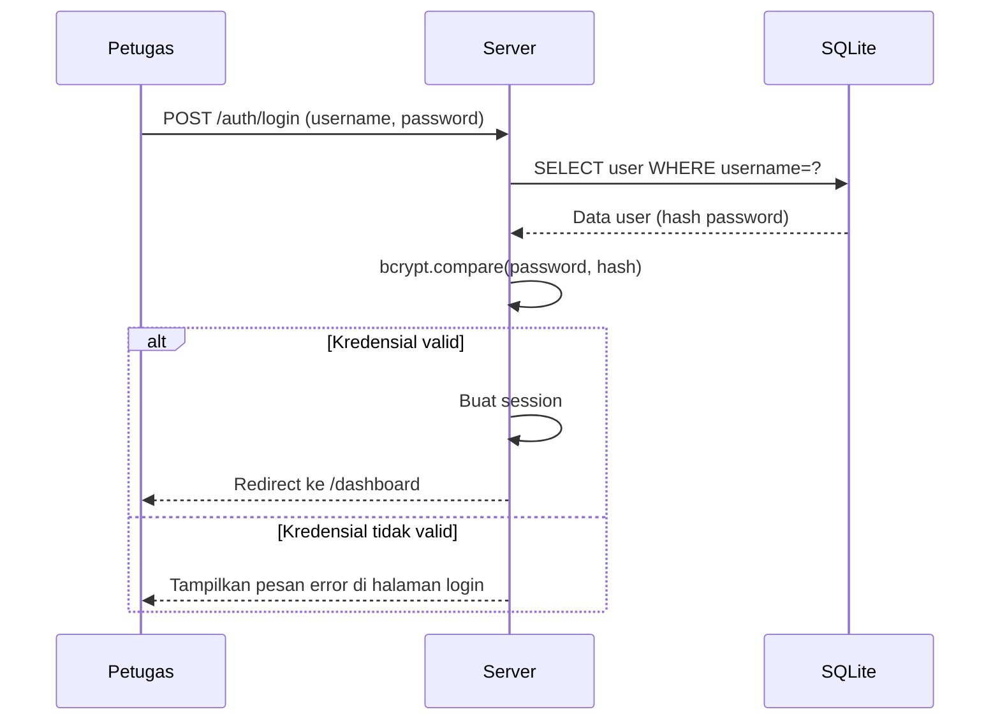

# Dokumen Desain Teknis: Buku Tamu Digital

## Ikhtisar

Buku Tamu Digital adalah aplikasi web yang menggantikan buku tamu fisik di kantor pemerintah. Sistem ini terdiri dari dua antarmuka utama: **Form Tamu** (publik, tanpa autentikasi) untuk pengisian data kunjungan oleh pengunjung, dan **Dashboard Petugas** (terproteksi autentikasi) untuk pemantauan dan manajemen data kunjungan secara real-time.

Saat pengunjung berhasil mendaftar, sistem secara otomatis mengirimkan notifikasi WhatsApp ke nomor pegawai yang menjadi tujuan kunjungan melalui WhatsApp Gateway pihak ketiga.

### Keputusan Desain Utama

- **Full-stack monolith** dengan Node.js + Express: cocok untuk skala kantor pemerintah, deployment sederhana, dan tim kecil.
- **SQLite** sebagai database: zero-configuration, file-based, cukup untuk volume kunjungan harian kantor, mudah di-backup.
- **Server-Sent Events (SSE)** untuk real-time update dashboard: lebih ringan dari WebSocket untuk use case satu arah (server → client).
- **Session-based authentication** dengan `express-session` + `bcrypt`: standar industri untuk aplikasi web tradisional.
- **Templating dengan EJS**: rendering sisi server untuk kesederhanaan, tanpa kebutuhan SPA framework.

---

## Arsitektur

Sistem menggunakan arsitektur **MVC (Model-View-Controller)** berbasis server-side rendering dengan tambahan SSE untuk fitur real-time.



### Alur Data Utama

**Alur Registrasi Tamu:**


**Alur Autentikasi Petugas:**


---

## Komponen dan Antarmuka

### 1. Lapisan Routing (`src/routes/`)

| Route | Method | Handler | Middleware | Deskripsi |
|-------|--------|---------|------------|-----------|
| `/` | GET | visitorController.showForm | - | Tampilkan form tamu |
| `/visits` | POST | visitorController.submitForm | - | Proses pengiriman form |
| `/visits/confirm` | GET | visitorController.showConfirm | - | Halaman konfirmasi sukses |
| `/auth/login` | GET | authController.showLogin | - | Tampilkan halaman login |
| `/auth/login` | POST | authController.processLogin | - | Proses autentikasi |
| `/auth/logout` | POST | authController.logout | requireAuth | Proses logout |
| `/dashboard` | GET | dashboardController.index | requireAuth | Halaman utama dashboard |
| `/dashboard/visits` | GET | dashboardController.getVisits | requireAuth | API: ambil data kunjungan (JSON) |
| `/dashboard/visits/:id/status` | PATCH | dashboardController.updateStatus | requireAuth | API: update status kunjungan |
| `/dashboard/events` | GET | sseController.stream | requireAuth | SSE stream untuk real-time |

### 2. Middleware Autentikasi (`src/middleware/auth.js`)

```javascript
// requireAuth: Memastikan request berasal dari sesi yang terautentikasi
function requireAuth(req, res, next) {
  if (req.session && req.session.userId) {
    return next();
  }
  return res.redirect('/auth/login');
}
```

### 3. Visitor Controller (`src/controllers/visitorController.js`)

Tanggung jawab:
- Menampilkan form tamu dengan daftar pegawai (tujuan kunjungan)
- Memvalidasi input form (nama, instansi, keperluan, tujuan tidak boleh kosong)
- Menyimpan data kunjungan ke database
- Memicu pengiriman notifikasi WhatsApp (async)
- Memicu broadcast SSE ke dashboard
- Menampilkan halaman konfirmasi atau error

### 4. Auth Controller (`src/controllers/authController.js`)

Tanggung jawab:
- Menampilkan halaman login
- Memverifikasi kredensial dengan `bcrypt.compare`
- Membuat/menghapus sesi autentikasi
- Redirect sesuai hasil autentikasi

### 5. Dashboard Controller (`src/controllers/dashboardController.js`)

Tanggung jawab:
- Menampilkan halaman dashboard (render awal dengan data hari ini)
- Menyediakan endpoint JSON untuk filter tanggal dan pencarian
- Memproses perubahan status kunjungan (Hadir → Selesai)

### 6. Notification Service (`src/services/notificationService.js`)

```javascript
// Interface utama
async function sendVisitNotification(visit, employee) {
  // Kirim HTTP POST ke WhatsApp Gateway
  // Catat hasil (sukses/gagal) ke log
  // TIDAK melempar exception - kegagalan tidak boleh membatalkan registrasi
}
```

Tanggung jawab:
- Memformat pesan notifikasi WhatsApp
- Mengirim request ke WhatsApp Gateway API
- Menangani error pengiriman secara graceful (log, tidak throw)

### 7. SSE Manager (`src/services/sseManager.js`)

```javascript
// Interface utama
function addClient(res)       // Daftarkan koneksi SSE baru
function removeClient(res)    // Hapus koneksi SSE yang terputus
function broadcast(eventData) // Kirim event ke semua klien terdaftar
```

Tanggung jawab:
- Mengelola daftar koneksi SSE aktif
- Mengirim event `new-visit` saat tamu baru terdaftar
- Mengirim event `status-update` saat status kunjungan berubah
- Membersihkan koneksi yang terputus

### 8. Lapisan View (`src/views/`)

| File | Deskripsi |
|------|-----------|
| `views/visitor/form.ejs` | Form pengisian tamu (publik) |
| `views/visitor/confirm.ejs` | Halaman konfirmasi sukses |
| `views/auth/login.ejs` | Halaman login petugas |
| `views/dashboard/index.ejs` | Dashboard utama petugas |
| `views/partials/header.ejs` | Header HTML bersama |
| `views/partials/footer.ejs` | Footer HTML bersama |

---

## Model Data

### Skema Database (SQLite)

#### Tabel `users` (Petugas)

```sql
CREATE TABLE users (
    id          INTEGER PRIMARY KEY AUTOINCREMENT,
    username    TEXT    NOT NULL UNIQUE,
    password    TEXT    NOT NULL,  -- bcrypt hash
    name        TEXT    NOT NULL,
    created_at  TEXT    NOT NULL DEFAULT (datetime('now', 'localtime'))
);
```

#### Tabel `employees` (Pegawai - Tujuan Kunjungan)

```sql
CREATE TABLE employees (
    id           INTEGER PRIMARY KEY AUTOINCREMENT,
    name         TEXT    NOT NULL,
    department   TEXT    NOT NULL,
    whatsapp_no  TEXT,             -- NULL jika tidak ada nomor WA
    created_at   TEXT    NOT NULL DEFAULT (datetime('now', 'localtime'))
);
```

#### Tabel `visits` (Data Kunjungan)

```sql
CREATE TABLE visits (
    id            INTEGER PRIMARY KEY AUTOINCREMENT,
    visitor_name  TEXT    NOT NULL,
    institution   TEXT    NOT NULL,
    purpose       TEXT    NOT NULL,
    employee_id   INTEGER NOT NULL REFERENCES employees(id),
    check_in_at   TEXT    NOT NULL DEFAULT (datetime('now', 'localtime')),
    check_out_at  TEXT,             -- NULL selama status "Hadir"
    status        TEXT    NOT NULL DEFAULT 'Hadir'
                          CHECK(status IN ('Hadir', 'Selesai')),
    created_at    TEXT    NOT NULL DEFAULT (datetime('now', 'localtime'))
);
```

### Model JavaScript

#### `Visit` Object

```javascript
{
  id: number,
  visitor_name: string,       // Nama lengkap pengunjung
  institution: string,        // Instansi/asal
  purpose: string,            // Keperluan kunjungan
  employee_id: number,        // FK ke tabel employees
  employee_name: string,      // JOIN dari tabel employees (untuk tampilan)
  check_in_at: string,        // ISO datetime string (waktu masuk)
  check_out_at: string|null,  // ISO datetime string (waktu keluar) atau null
  status: 'Hadir' | 'Selesai'
}
```

#### `Employee` Object

```javascript
{
  id: number,
  name: string,
  department: string,
  whatsapp_no: string|null    // Format: '628xxxxxxxxxx' atau null
}
```

#### `User` Object

```javascript
{
  id: number,
  username: string,
  password: string,           // bcrypt hash, TIDAK pernah dikirim ke client
  name: string
}
```

### Validasi Input Form Tamu

| Field | Aturan Validasi |
|-------|----------------|
| `visitor_name` | Wajib, tidak boleh hanya whitespace, max 255 karakter |
| `institution` | Wajib, tidak boleh hanya whitespace, max 255 karakter |
| `purpose` | Wajib, tidak boleh hanya whitespace, max 500 karakter |
| `employee_id` | Wajib, harus berupa integer valid yang ada di tabel `employees` |

---

## Penanganan Error

### Strategi Umum

Sistem menggunakan pendekatan **fail-safe** untuk operasi non-kritis (notifikasi WA) dan **fail-fast** untuk operasi kritis (penyimpanan data).

### Tabel Penanganan Error

| Skenario | Penanganan | Respons ke Pengguna |
|----------|-----------|---------------------|
| Validasi form gagal (field kosong) | Tampilkan ulang form dengan pesan error per field | Pesan error spesifik per kolom |
| `employee_id` tidak valid | Validasi server-side, tolak submission | Pesan error "Tujuan kunjungan tidak valid" |
| Kegagalan INSERT ke database | Log error, tampilkan halaman error | "Terjadi kesalahan sistem, silakan coba lagi" |
| Kegagalan kirim notifikasi WA | Log error (level: warn), lanjutkan proses | Tidak ada notifikasi ke pengunjung |
| Tujuan kunjungan tanpa nomor WA | Log info, lewati pengiriman | Tidak ada notifikasi ke pengunjung |
| Kredensial login salah | Tampilkan pesan error generik | "Nama pengguna atau kata sandi salah" |
| Akses dashboard tanpa sesi | Redirect ke `/auth/login` | Redirect otomatis |
| SSE client disconnect | Hapus dari daftar klien aktif | Tidak ada (silent cleanup) |

### Format Pesan Error Validasi Form

```javascript
// Contoh respons validasi gagal (render ulang form)
{
  errors: {
    visitor_name: "Nama lengkap wajib diisi",
    institution: null,
    purpose: "Keperluan kunjungan wajib diisi",
    employee_id: null
  },
  values: { /* nilai yang sudah diisi pengunjung */ }
}
```

### Logging

Sistem menggunakan `console` standar Node.js dengan level:
- `console.error`: Kegagalan kritis (DB error, crash)
- `console.warn`: Kegagalan non-kritis (WA gateway gagal)
- `console.info`: Event penting (kunjungan baru, status update, login/logout)

---

## Properti Kebenaran (Correctness Properties)

*Properti adalah karakteristik atau perilaku yang harus berlaku di seluruh eksekusi sistem yang valid — pada dasarnya, pernyataan formal tentang apa yang seharusnya dilakukan sistem. Properti berfungsi sebagai jembatan antara spesifikasi yang dapat dibaca manusia dan jaminan kebenaran yang dapat diverifikasi secara otomatis.*

### Properti 1: Validasi field wajib menolak input kosong/whitespace

*Untuk setiap* kombinasi input form di mana satu atau lebih field wajib (nama lengkap, instansi/asal, keperluan, tujuan kunjungan) hanya berisi whitespace atau string kosong, fungsi validasi SHALL mengembalikan `{ valid: false }` dan mengidentifikasi setiap field yang bermasalah dalam objek `errors`.

**Memvalidasi: Persyaratan 1.2, 1.3**

### Properti 2: Penyimpanan data kunjungan mempertahankan semua atribut (round-trip)

*Untuk setiap* data kunjungan valid yang disimpan ke database, membaca kembali data tersebut berdasarkan ID SHALL menghasilkan objek dengan nilai yang identik untuk semua atribut: `visitor_name`, `institution`, `purpose`, `employee_id`, dan status awal SHALL bernilai `"Hadir"`.

**Memvalidasi: Persyaratan 1.4, 1.6, 4.1, 4.4**

### Properti 3: Transisi status kunjungan bersifat satu arah dan mencatat waktu keluar

*Untuk setiap* kunjungan dengan status `"Hadir"`, ketika status diubah menjadi `"Selesai"`, sistem SHALL memperbarui status menjadi `"Selesai"` DAN mengisi `check_out_at` dengan waktu saat ini (tidak null). Percobaan untuk mengubah status `"Selesai"` kembali ke `"Hadir"` SHALL ditolak.

**Memvalidasi: Persyaratan 6.2, 6.4**

### Properti 4: Kegagalan notifikasi WA tidak membatalkan penyimpanan data

*Untuk setiap* data kunjungan valid, apabila pengiriman notifikasi WhatsApp gagal dengan alasan apapun (gateway tidak tersedia, timeout, nomor tidak terdaftar, pegawai tanpa nomor WA), data kunjungan SHALL tetap tersimpan di database dengan status `"Hadir"` dan proses registrasi SHALL dianggap berhasil dari sudut pandang pengunjung.

**Memvalidasi: Persyaratan 5.3, 5.5**

### Properti 5: Filter pencarian bersifat inklusif dan tidak menghasilkan false negative

*Untuk setiap* kata kunci pencarian dan daftar kunjungan yang tersimpan, semua entri yang dikembalikan SHALL mengandung kata kunci tersebut pada field `visitor_name` atau nama pegawai tujuan kunjungan, DAN tidak ada entri yang mengandung kata kunci tersebut yang boleh dihilangkan dari hasil pencarian.

**Memvalidasi: Persyaratan 3.6**

### Properti 6: Filter tanggal hanya mengembalikan data untuk tanggal yang dipilih

*Untuk setiap* tanggal yang dipilih sebagai filter dan daftar kunjungan dengan berbagai tanggal, semua entri yang dikembalikan SHALL memiliki `check_in_at` pada tanggal yang dipilih, dan tidak ada entri dari tanggal lain yang boleh muncul dalam hasil.

**Memvalidasi: Persyaratan 3.5**

### Properti 7: Password selalu disimpan dalam bentuk bcrypt hash

*Untuk setiap* string password yang diberikan, nilai yang dihasilkan oleh fungsi hashing SHALL berbeda dari nilai plaintext, SHALL dapat diverifikasi dengan `bcrypt.compare(plaintext, hash) === true`, dan SHALL menggunakan cost factor minimum 10.

**Memvalidasi: Persyaratan 2.7**

### Properti 8: Format pesan notifikasi mengandung semua informasi kunjungan

*Untuk setiap* data kunjungan valid, string pesan notifikasi yang dihasilkan oleh fungsi format SHALL mengandung: nama lengkap pengunjung, instansi/asal, keperluan kunjungan, dan waktu masuk.

**Memvalidasi: Persyaratan 5.2**

---

## Strategi Pengujian

### Pendekatan Pengujian Ganda

Sistem menggunakan dua lapisan pengujian yang saling melengkapi:

1. **Unit Test (berbasis contoh)**: Memverifikasi perilaku spesifik dengan input konkret
2. **Property-Based Test (PBT)**: Memverifikasi properti universal di seluruh ruang input

### Library yang Digunakan

- **Test runner**: [Jest](https://jestjs.io/) — standar ekosistem Node.js
- **Property-based testing**: [fast-check](https://fast-check.dev/) — library PBT untuk JavaScript/TypeScript
- **HTTP testing**: [supertest](https://github.com/ladjs/supertest) — untuk integration test endpoint

### Unit Test (Berbasis Contoh)

Fokus pada:
- Skenario spesifik validasi form (field kosong, field valid, kombinasi)
- Alur autentikasi (login sukses, login gagal, logout)
- Render halaman konfirmasi setelah submit berhasil
- Halaman login menampilkan error saat kredensial salah
- Redirect ke login saat akses dashboard tanpa sesi

### Property-Based Test

Setiap property test dikonfigurasi dengan **minimum 100 iterasi**.

Format tag: `Feature: digital-guest-book, Property {nomor}: {teks properti}`

#### PBT 1 — Validasi field wajib menolak input kosong/whitespace
```
Feature: digital-guest-book, Property 1: Validasi field wajib menolak input kosong/whitespace
```
- Generator: Hasilkan kombinasi input di mana minimal satu field wajib berisi string whitespace atau kosong
- Verifikasi: Fungsi `validateVisitForm(input)` mengembalikan `{ valid: false, errors: {...} }` dengan field yang bermasalah teridentifikasi

#### PBT 2 — Penyimpanan data kunjungan mempertahankan semua atribut
```
Feature: digital-guest-book, Property 2: Penyimpanan data kunjungan mempertahankan semua atribut
```
- Generator: Hasilkan objek kunjungan valid dengan string acak untuk nama, instansi, keperluan
- Verifikasi: `insertVisit(data)` → `getVisitById(id)` menghasilkan objek yang identik

#### PBT 3 — Transisi status kunjungan bersifat satu arah
```
Feature: digital-guest-book, Property 3: Transisi status kunjungan bersifat satu arah dan mencatat waktu keluar
```
- Generator: Hasilkan kunjungan dengan status "Hadir"
- Verifikasi: Setelah `updateStatus(id, 'Selesai')`, `getVisitById(id)` memiliki `status='Selesai'` dan `check_out_at` tidak null

#### PBT 4 — Kegagalan notifikasi WA tidak membatalkan penyimpanan
```
Feature: digital-guest-book, Property 4: Kegagalan notifikasi WA tidak membatalkan penyimpanan data
```
- Generator: Hasilkan data kunjungan valid; mock WA gateway untuk selalu gagal
- Verifikasi: Data kunjungan tetap tersimpan di database meskipun `sendVisitNotification` melempar error

#### PBT 5 — Filter pencarian bersifat inklusif
```
Feature: digital-guest-book, Property 5: Filter pencarian bersifat inklusif dan tidak menghasilkan false negative
```
- Generator: Hasilkan daftar kunjungan acak dan kata kunci pencarian
- Verifikasi: Semua hasil mengandung kata kunci; tidak ada yang mengandung kata kunci tapi tidak muncul di hasil

#### PBT 6 — Filter tanggal hanya mengembalikan data untuk tanggal yang dipilih
```
Feature: digital-guest-book, Property 6: Filter tanggal hanya mengembalikan data untuk tanggal yang dipilih
```
- Generator: Hasilkan kunjungan dengan berbagai tanggal acak, pilih satu tanggal sebagai filter
- Verifikasi: Semua hasil memiliki `check_in_at` pada tanggal yang dipilih; tidak ada entri dari tanggal lain

#### PBT 7 — Password selalu disimpan dalam bentuk bcrypt hash
```
Feature: digital-guest-book, Property 7: Password selalu disimpan dalam bentuk bcrypt hash
```
- Generator: Hasilkan string password acak (berbagai panjang dan karakter)
- Verifikasi: `hashPassword(plain)` menghasilkan string yang berbeda dari input, `bcrypt.compare(plain, hash) === true`, dan `bcrypt.getRounds(hash) >= 10`

#### PBT 8 — Format pesan notifikasi mengandung semua informasi kunjungan
```
Feature: digital-guest-book, Property 8: Format pesan notifikasi mengandung semua informasi kunjungan
```
- Generator: Hasilkan data kunjungan acak (nama, instansi, keperluan, waktu masuk bervariasi)
- Verifikasi: `formatNotificationMessage(visit)` menghasilkan string yang mengandung semua field: visitor_name, institution, purpose, check_in_at

### Integration Test

- Alur lengkap registrasi tamu (POST form → DB → SSE broadcast)
- Alur login → akses dashboard → logout
- Endpoint PATCH status kunjungan dengan autentikasi
- SSE: koneksi terbuka, menerima event saat ada kunjungan baru

### Struktur Direktori Test

```
tests/
├── unit/
│   ├── validation.test.js       # Unit + PBT 1: validasi form
│   ├── visitModel.test.js       # Unit + PBT 2: round-trip penyimpanan
│   ├── statusTransition.test.js # Unit + PBT 3: transisi status
│   ├── notification.test.js     # Unit + PBT 4, 8: fault-tolerance & format pesan
│   ├── search.test.js           # Unit + PBT 5: filter pencarian
│   ├── dateFilter.test.js       # Unit + PBT 6: filter tanggal
│   └── auth.test.js             # Unit + PBT 7: password hashing
└── integration/
    ├── visitorFlow.test.js      # Alur registrasi end-to-end
    ├── authFlow.test.js         # Alur autentikasi end-to-end
    └── dashboardFlow.test.js    # Alur dashboard + SSE end-to-end
```
